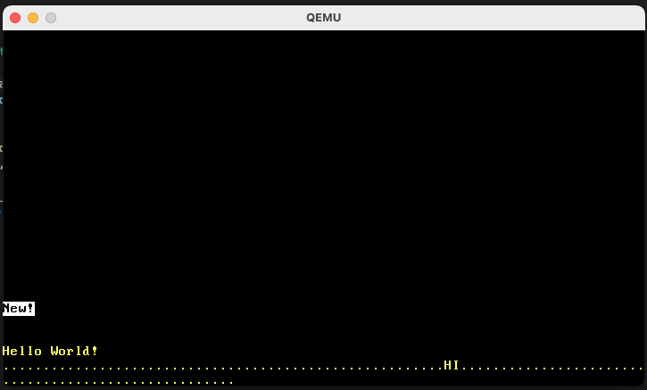

# rust-os
Implementation of a bare metal operating system in Rust. This was made following Phil Opperman's blog at https://os.phil-opp.com/.

## Dependencies 
This project features a number of rust libraries that assist with OS development. Notable ones include 'bootloader' (x86_64 bootloader), 'x86-64' (support for x86_64 specific instructions) and 'pic_8259' (handling for basic I/O interrupts). Read more below:

* `Bootloader`: https://github.com/rust-osdev/bootloader
* `x86_64`: https://github.com/rust-osdev/x86_64
* `pic_8259`: https://crates.io/crates/pic8259
  
## Running the application

First, make sure that you have QEMU - a machine emulator and virtualizer - installed. See https://www.qemu.org/ for installation instructions. Once you do, just do 'cargo run' in your terminal.

## Functionality 

This project features the following: 
* VGA Text Display 
* CPU Exceptions
* Hardware Interrupts
* Paging 
* Heap Allocation
* Async/Await

This is a demo of the OS in action:

